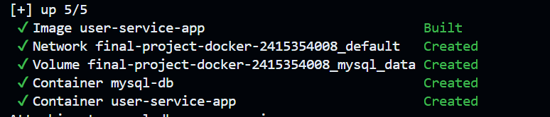
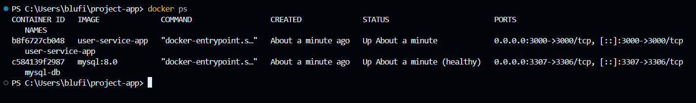
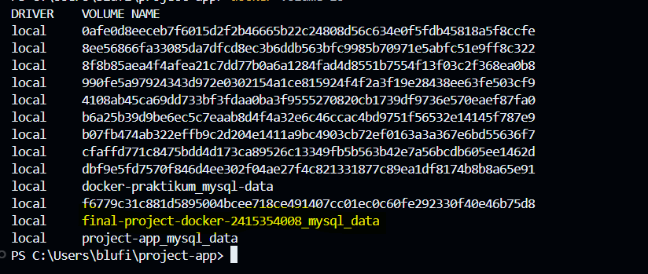
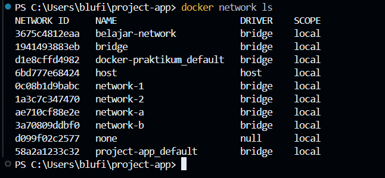
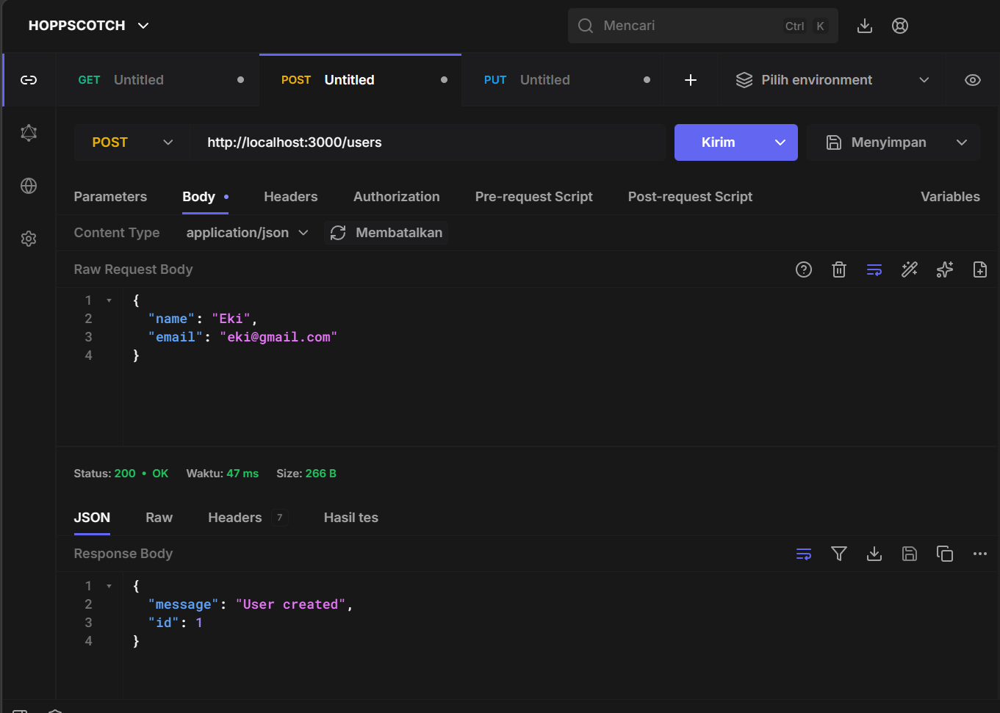
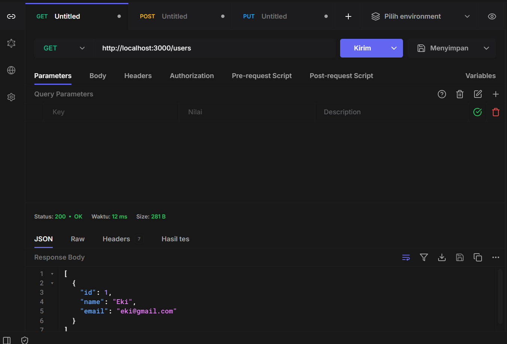
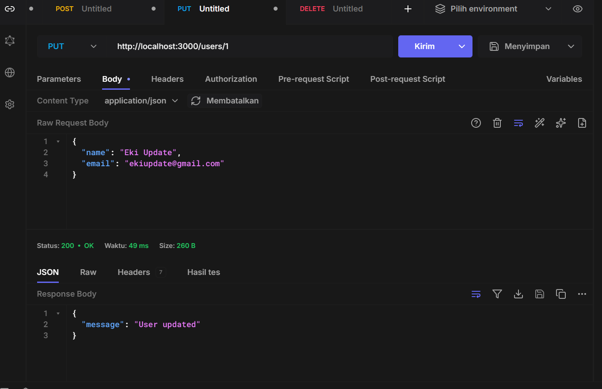
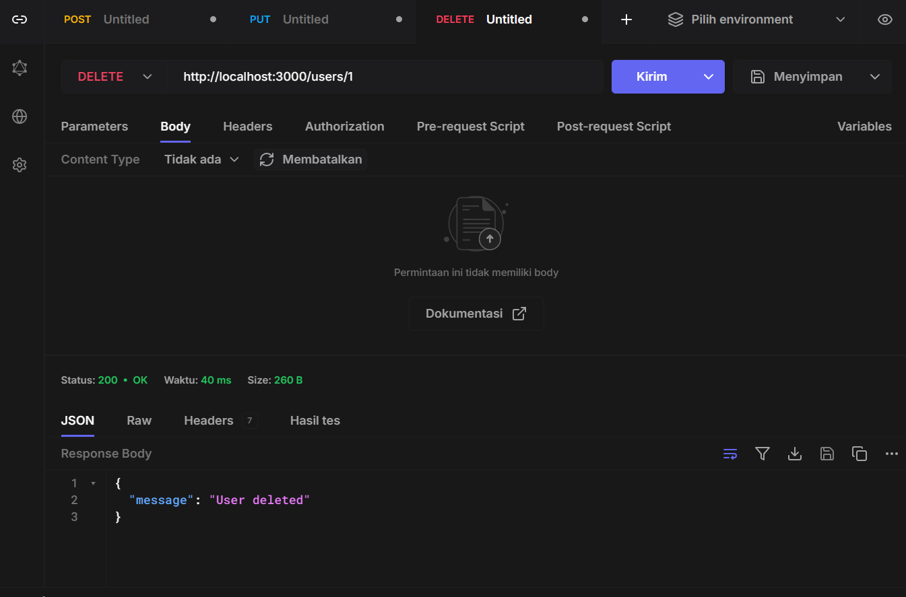
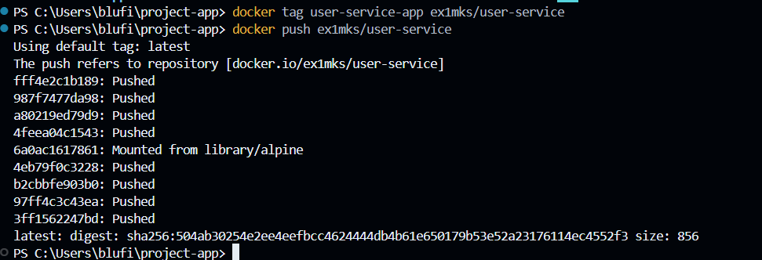
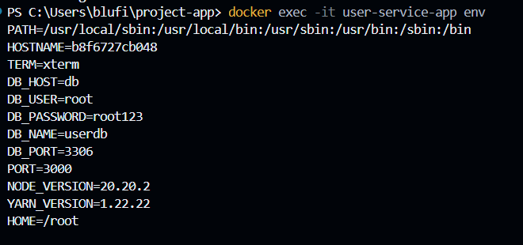

# Laporan Hasil Praktikum: Final Project Docker Deployment

## Identitas Mahasiswa

- **Nama:** Eki Mukhlis
- **NIM:** 2415354008
- **Kelas/Rombel:** TRPL 4D
- **Tanggal Praktikum:** 20 Mei 2026

---

# Teknologi & Tools yang Digunakan

- **Sistem Operasi:** Windows 11
- **Containerization:** Docker & Docker Compose
- **Bahasa Pemrograman:** Node.js
- **Database:** MySQL
- **Tools Lain:** VS Code, Git, Postman, Docker Hub

---

# Deskripsi Project

Project ini merupakan implementasi multi-container application menggunakan Docker dan Docker Compose menggunakan Node.js dan MySQL.

Fitur aplikasi:

- CRUD User API
- Docker Compose
- Docker Volume
- Docker Network
- Environment Variable
- Multi-container architecture

---

# Struktur Project

```bash
project-app/
│
├── app/
│   ├── app.js
│   ├── db.js
│   ├── package.json
│   ├── Dockerfile
│   └── .dockerignore
│
├── docker-compose.yml
├── .env
└── README.md
```

---

# Langkah-Langkah Praktikum & Dokumentasi

## Langkah 1: Menjalankan Docker Compose

Pada langkah ini dilakukan proses build dan menjalankan multi-container application menggunakan Docker Compose.

Command:

```bash
docker compose up --build
```

Hasil:

- Backend container berhasil berjalan
- Database MySQL berhasil berjalan
- Backend berhasil terhubung dengan database

**Dokumentasi/Screenshot:**  


---

## Langkah 2: Pengujian Container Docker

Pada langkah ini dilakukan pengecekan container yang sedang berjalan.

Command:

```bash
docker ps
```

Hasil:

Container yang berjalan:

- user-service-app
- mysql-db

**Dokumentasi/Screenshot:**  


---

## Langkah 3: Pengujian Docker Volume

Pada langkah ini dilakukan pengecekan Docker Volume yang digunakan untuk menyimpan data database MySQL.

Command:

```bash
docker volume ls
```

Hasil:

Docker Volume `mysql_data` berhasil dibuat dan digunakan untuk menyimpan data MySQL.

**Dokumentasi/Screenshot:**  


---

## Langkah 4: Pengujian Docker Network

Pada langkah ini dilakukan pengecekan Docker Network yang digunakan untuk komunikasi antar container.

Command:

```bash
docker network ls
```

Hasil:

Docker Network berhasil dibuat dan container backend serta database dapat saling terhubung.

**Dokumentasi/Screenshot:**  


---

## Langkah 5: Pengujian Endpoint API

Base URL:

```text
http://localhost:3000
```

### GET /users

Request:

```http
GET /users
```

Response:

```json
[]
```

Hasil:

Endpoint GET berhasil menampilkan data user.

---

### POST /users

Request:

```http
POST /users
```

Body:

```json
{
  "name": "Eki",
  "email": "eki@gmail.com"
}
```

Response:

```json
{
  "message": "User created",
  "id": 1
}
```

Hasil:

Data user berhasil ditambahkan ke database.

---

### PUT /users/1

Request:

```http
PUT /users/1
```

Body:

```json
{
  "name": "Eki Update",
  "email": "ekiupdate@gmail.com"
}
```

Response:

```json
{
  "message": "User updated"
}
```

Hasil:

Data user berhasil diperbarui.

---

### DELETE /users/1

Request:

```http
DELETE /users/1
```

Response:

```json
{
  "message": "User deleted"
}
```

Hasil:

Data user berhasil dihapus dari database.

**Dokumentasi/Screenshot:**  





---

## Langkah 6: Pengujian Upload ke Docker Hub

Pada langkah ini dilakukan proses login, build image, dan upload image ke Docker Hub.

### Login Docker Hub

```bash
docker login
```

---

### Build Docker Image

```bash
docker build -t username/user-service ./app
```

---

### Push Docker Image

```bash
docker push username/user-service
```

Hasil:

Docker image berhasil diupload ke Docker Hub.

**Dokumentasi/Screenshot:**  


---

## Langkah 7: Pengujian Environment Variable

Aplikasi berhasil menggunakan environment variable dari file `.env`.

Contoh:

```env
DB_HOST=db
DB_USER=root
DB_PASSWORD=root123
DB_NAME=userdb
DB_PORT=3306
PORT=3000
```

Hasil:

Environment variable berhasil digunakan oleh aplikasi backend dan database.

**Dokumentasi/Screenshot:**  


---

## Langkah 8: Pengujian Multi-Container Architecture

Project terdiri dari:

- Backend container Node.js
- Database container MySQL

Kedua container berhasil berjalan secara terpisah dan saling terhubung menggunakan Docker Compose.

**Dokumentasi/Screenshot:**  


---

# Kesimpulan

Project CRUD User berhasil diimplementasikan menggunakan Node.js, MySQL, Docker, dan Docker Compose.

Aplikasi berhasil menerapkan:

- Multi-container architecture
- Docker Volume
- Docker Network
- Environment Variable
- CRUD REST API
- Docker Hub deployment

Seluruh service berhasil berjalan dengan baik menggunakan perintah:

```bash
docker compose up
```

Praktikum ini memberikan pemahaman mengenai implementasi containerization menggunakan Docker serta pengelolaan multi-container application menggunakan Docker Compose.